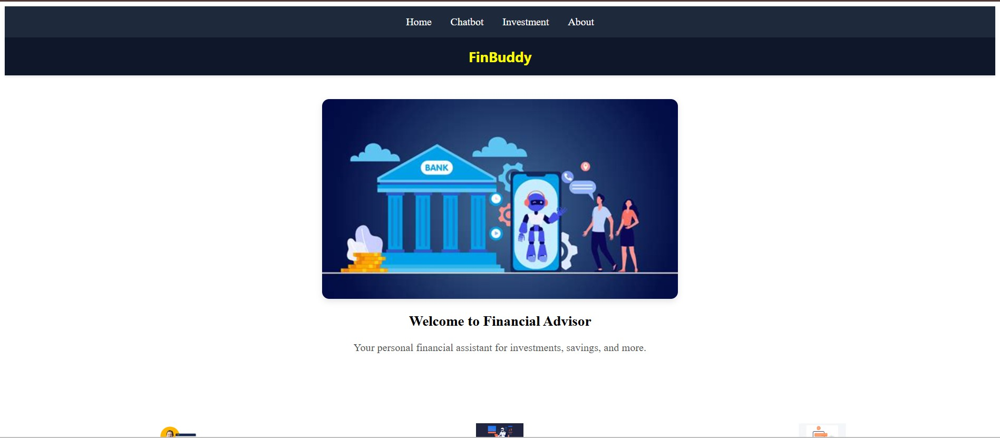

# 💡 Google GDG Solutions Challenge - 2025  
## 💰 FinBudd – A Financial Investment Advisor and Planner

### 👥 Team Name: Chiti d robo

FinBudd is an intelligent financial advisor that helps users plan and optimize investments using Generative AI. It supports analyzing financial documents (PDFs, TXTs, CSVs), extracting meaningful insights, and answering user queries using natural language.

---

## 🧠 Problem Statement

### GenAI-Powered Financial Assistant for Better Investing Decisions

Financial literacy levels are critically low in India, even as the number of new investors continues to surge. Millions of people are entering the financial markets, but there's little to no guidance available to help them make informed decisions. Traditional education or advisory services cannot scale to meet the needs of this growing population.

We believe the solution lies in **AI-driven scalability**. FinBudd is a conversational AI platform that empowers users to understand financial products, interpret their documents, and receive personalized advice — all in natural language. By harnessing Generative AI, we're working to democratize investment knowledge and enable users to invest with confidence.

---

## 🎯 Objective

To build a **GenAI-based financial assistant** that allows users to:

- Ask both basic and complex questions about investments.
- Understand financial products and strategies.
- Upload financial documents (PDF, TXT, CSV) and receive contextual analysis.
- Receive personalized suggestions based on their portfolio and financial goals.

---

## 🚀 Technologies Used

- **Frontend**: Vite + React  
- **Backend**: Flask (Python 3.10 recommended)  
- **Vector Database**: FAISS  
- **Embedding Model**: HuggingFace BGE Embedding Model  
- **LLM Inference**: Gemini API  

---

## ⚙️ How to Run the Application

### 1️⃣ Clone the Repository

```bash
git clone https://github.com/Tejes123/FinBuddy---Financial-Investment-Assissstant-Tool---Google-GDG-.git
cd FinBuddy---Financial-Investment-Assissstant-Tool---Google-GDG-
```

---

### 2️⃣ Backend Setup (Flask + FAISS + Gemini API)

#### 🔹 Create Python virtual environment (Python 3.10 recommended)

```bash
python -m venv your-venv-name
```

#### 🔹 Activate the virtual environment

```bash
cd backend
your-venv-name\Scripts\activate  # On Windows
# source your-venv-name/bin/activate  # On Mac/Linux
```

#### 🔹 Install dependencies

```bash
pip install -r requirements.txt
```

#### 🔹 Create a `.env` file inside the `backend` directory and add your Gemini API key:

```env
GEMINI_API_KEY=your-gemini-api-key
```

#### 🔹 Allow loading serialized FAISS vectors

Make sure the following line exists in `faiss.py`:

```python
allow_dangerous_deserialization = True
```

#### 🔹 Ingest and embed financial documents (PDFs, TXTs, CSVs)

```bash
python ingestDocuments.py
```

This will create a FAISS vector database in the local directory.

#### 🔹 Start the backend server

```bash
python server.py
```

---

### 3️⃣ Frontend Setup (Vite + React)

#### 🔸 Install Node.js  
👉 [Download Node.js](https://nodejs.org/en)

#### 🔸 Navigate to the frontend directory

```bash
cd ../frontend
```

#### 🔸 Initialize Node package (if not already done)

```bash
npm init -y
```

#### 🔸 Install frontend dependencies

```bash
npm install
```

#### 🔸 Create a `.env` file in the frontend directory:

```env
VITE_BACKEND_URL=http://127.0.0.1:5000
```

#### 🔸 Start the frontend development server

```bash
npm run dev
```

The app will typically run at: [http://localhost:5173/](http://localhost:5173/)

---

## Screenshots of Prototype
### Home Page



## 💡 Usage

1. Open the app in your browser.
2. Ask questions like:
   - "What is the total value of my investments?"
   - "Can you suggest safer alternatives to mutual funds?"
   - "What are the top performing assets?"
3. View AI-generated insights and recommendations.

---

## ✨ Features

- Chat with your financial documents
- Supports PDFs, TXTs, and CSVs
- Secure and private local vector storage
- Fast semantic search and contextual understanding
- AI-powered answers using Google Gemini
- Beginner-friendly financial guidance

---

## 📦 Dependencies

### Backend

- Flask
- Python 3.10+
- FAISS
- HuggingFace Transformers
- python-dotenv
- Gemini API SDK

### Frontend

- React
- Vite
- Axios
- Node.js

---

## ⚙️ Configuration

### Backend `.env` file

```env
GEMINI_API_KEY=your_api_key
```

### Frontend `.env` file

```env
VITE_BACKEND_URL=http://127.0.0.1:5000
```

---

## 🧪 Examples

Example user queries:

- "Summarize my investment portfolio."
- "What are my risky investments?"
- "Show me tax-saving opportunities."
- "Compare fixed deposits and mutual funds."

---

## 🛠 Troubleshooting

- Ensure your Python version is 3.10+.
- Check `.env` files are correctly set up and **not** committed.
- Ensure FAISS vector store is built via `ingestDocuments.py`.
- Restart servers if connections fail.
- Use sample financial files to test the pipeline.

---

## 🤝 Team Members

- [Sriram N](https://github.com/Sriram-2706)(Team Leader)
- [Sujit T K](https://github.com/sujit-t-k)
- [Tejeswar](https://github.com/Tejes123)
- [Aravind S](https://github.com/AmazeAravind-5904)


---

## 📌 Notes

- Keep `.env` private – don’t commit it to version control.
- Backend models require internet for Gemini API.
- Test performance across different document formats.

---

## 📜 License

MIT License. Feel free to use and modify.

---

Made with ❤️ by **Team Chiti d robo** – GDG Solutions Challenge 2025
